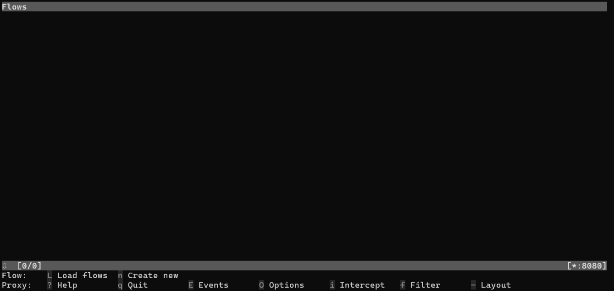
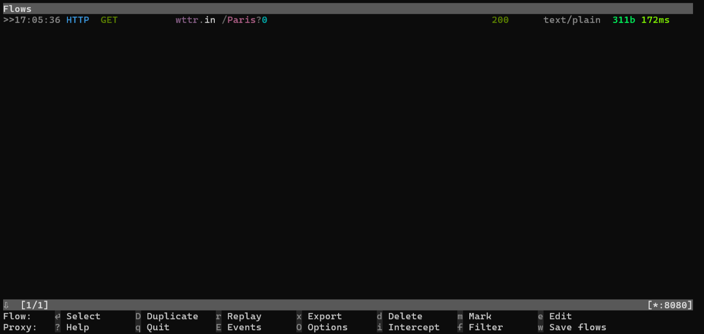
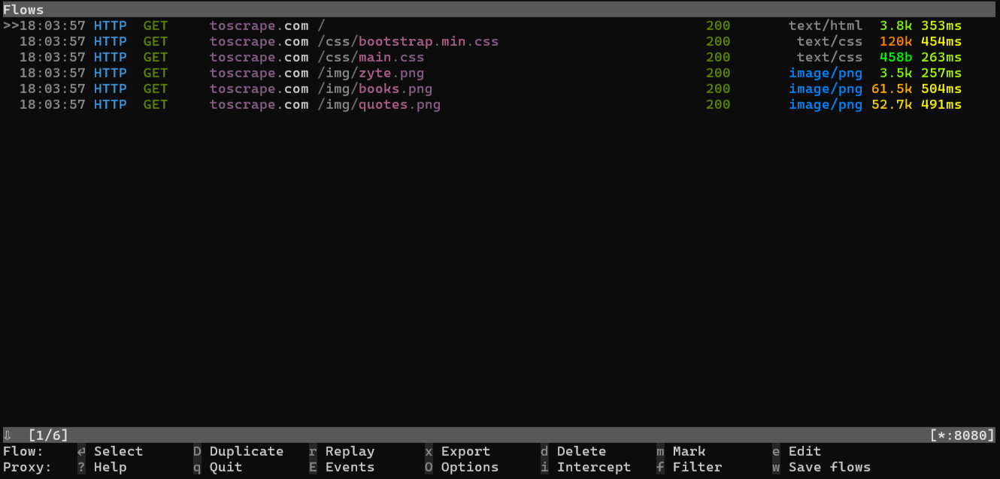

[](https://www.bright.cn/?promo=github15)

# 如何在 Node.js 中使用代理服务器
本文将为你演示如何在 `node-fetch`、Playwright 和 Puppeteer 中集成代理。同时，你也会了解到在 Axios 中使用 Bright Data 的[住宅代理](https://www.bright.cn/proxy-types/residential-proxies)的方法。你也可以在 [Bright Data 的博客](https://www.bright.cn/blog/how-tos/nodejs-proxy-servers)中查看此指南。

- [环境要求](#环境要求)
  * [搭建本地代理服务器](#搭建本地代理服务器)
- [在 Node.js 中集成代理](#在-Node.js-中集成代理)
  * [在 `node-fetch` 中集成本地代理](#在-node-fetch-中集成本地代理)
  * [在 Playwright 中使用本地代理](#在-Playwright-中使用本地代理)
  * [在 Puppeteer 中使用本地代理](#在-Puppeteer-中使用本地代理)
- [在 Node.js 中集成 Bright Data 代理](#在-Node.js-中集成-Bright-Data-代理)
  * [住宅代理配置](#住宅代理配置)
  * [Axios 代理设置](#Axios-代理设置)
  * [测试 IP 轮换](#测试-IP-轮换)

## 环境要求
确保你的机器上已安装了 Node.js。如未安装，可从 [Node.js 官方网站](https://nodejs.org/en/download) 下载并运行安装程序，按照向导完成安装。

创建一个用于存放 Node.js 项目的文件夹，进入该文件夹后，在其中初始化一个 npm 应用：
```bash
mkdir <NODE_PROJECT_FOLDER_NAME>
cd <NODE_PROJECT_FOLDER_NAME>
npm init -y
```

### 搭建本地代理服务器
[mitmproxy](https://mitmproxy.org/) 是一个开源的交互式 HTTPS 代理工具。可以使用它来搭建本地代理服务器。

按照 [官方文档](https://docs.mitmproxy.org/stable/overview-installation/) 的说明，在你的操作系统上安装 mitmproxy，然后启动它：
```bash
mitmproxy
```
接下来，会出现以下界面：  


你现在有了一个本地代理服务器，默认监听在 `8080` 端口。使用以下命令进行验证：

```
curl --proxy http://localhost:8080 "http://wttr.in/Paris?0"
```
**注意**：在 Windows 上请使用 `curl.exe` 而不是 `curl`。

运行结果示例如下：
```
Weather report: Paris

                Overcast
       .--.     -2(-6) °C
    .-(    ).   ↙ 11 km/h
   (___.__)__)  10 km
                0.0 mm
```

然后回到 mitmproxy 界面，你会看到它拦截了这次请求：  


## 在 Node.js 中集成代理
下面让我们分别使用以下技术，通过本地代理服务器访问某个站点：
* [`node-fetch`](https://www.npmjs.com/package/node-fetch)
* [Playwright](https://playwaright.dev/)
* [Puppeteer](https://pptr.dev/)

### 在 `node-fetch` 中集成本地代理
需要使用 `http-proxy-agent` 库为 `node-fetch` 配置代理。

安装命令：
```bash
npm install node-fetch http-proxy-agent
```
**注意**：`node-fetch` v3.x 仅支持 ESM 语法，请确保在 `package.json` 中设置 `"type":"module"`。

使用 `fetch()` 方法通过代理服务器发送请求示例：
```javascript
// node-fetch-proxy.js

import fetch from "node-fetch";
import { HttpProxyAgent } from "http-proxy-agent";

async function fetchData(url) {
  try {
    // 初始化本地代理 agent
    const proxyAgent = new HttpProxyAgent(
      "http://localhost:8080"
    );
    // 通过本地代理访问目标站点
    const response = await fetch(url, {
      agent: proxyAgent,
    });

    // 获取服务器返回的 HTML 并打印
    const data = await response.text();
    console.log(data);
  } catch (error) {
    console.error("Error fetching data:", error);
  }
}

fetchData("http://toscrape.com/");
```

### 在 Playwright 中使用本地代理
将 Playwright 添加到项目依赖中：
```bash
npm install playwright
```

完成 Playwright 的安装：
```bash
npx playwright install --with-deps
```
**注意**：此操作会耗时较长，因为它会安装浏览器及其相关依赖。

在新建的 `playwright-proxy.js` 文件中配置代理：
```javascript
// playwright-proxy.js

import { chromium } from "playwright";

(async () => {
  // 使用本地代理配置启动 Chromium
  const browser = await chromium.launch({
    proxy: {
      server: "http://localhost:8080",
    },
  });

  // 打开新页面并访问目标网址
  const page = await browser.newPage();
  await page.goto("http://toscrape.com/");

  // 获取页面 HTML 内容并打印
  const content = await page.content();
  console.log(content);

  // 关闭浏览器
  await browser.close();
})();
```

### 在 Puppeteer 中使用本地代理
安装 Puppeteer:
```bash
npm install puppeteer
```

在 `puppeteer-proxy.js` 中配置 Puppeteer 的本地代理：
```javascript
// puppeteer-proxy.js

import puppeteer from "puppeteer";

(async () => {
    // 通过 `--proxy-server` 标志将本地代理配置到 Chrome
    const browser = await puppeteer.launch({
        args: ["--proxy-server=http://localhost:8080"]
    });

    // 打开新页面并访问目标站点
    const page = await browser.newPage();
    await page.goto("http://toscrape.com/");

    // 获取页面 HTML 并打印
    const content = await page.content();
    console.log(content);

    // 关闭浏览器
    await browser.close();
})();
```

## 在 Node.js 中测试代理集成
使用以下命令运行上面介绍的脚本：
```bash
node <NODE_SCRIPT_NAME>
```

脚本会打印出类似以下的 HTML：
```html
<!DOCTYPE html>
<html lang="en">
    <head>
        <meta http-equiv="Content-Type" content="text/html; charset=UTF-8">
        <title>Scraping Sandbox</title>
        <link href="./css/bootstrap.min.css" rel="stylesheet">
        <link href="./css/main.css" rel="stylesheet">
    </head>
    <body>
    <!-- omitted for brevity ... -->
```

在 mitmproxy 界面上将会记录脚本发出的所有请求。  
对于 `node-fetch`，它只会显示对 `http://toscrape.com/` 的一个 GET 请求。  
对于 Playwright 和 Puppeteer，还会看到浏览器加载页面时对 JS 和 CSS 文件的请求：  


## 在 Node.js 中集成 Bright Data 代理
Bright Data 提供了[高质量代理](https://www.bright.cn/proxy-types)，可自动轮换出口 IP。以下示例演示如何在 Node.js 中使用 Axios 结合 Bright Data 住宅代理。

### 住宅代理配置
[注册 Bright Data](https://www.bright.cn/cp/start) 以试用其服务。在“Proxies & Scraping Infrastructure”页面中配置一个新的住宅代理。

你需要获取以下凭证：  
* `<BRIGHTDATA_PROXY_HOST>`
* `<BRIGHTDATA_PROXY_PORT>`
* `<BRIGHTDATA_PROXY_USERNAME>`
* `<BRIGHTDATA_PROXY_PASSWORD>`

### Axios 代理设置
安装 Axios：
```bash
npm install axios
```

在 `axios-proxy.js` 中加入如下示例，将 Bright Data 的住宅代理与 Axios 集成：
```javascript
import axios from "axios";

async function fetchDataWithBrightData(url) {
    // 配置 Axios 通过指定代理转发流量
    const proxyOptions = {
        proxy: {
            host: "<BRIGHTDATA_PROXY_HOST>",
            port: "<BRIGHTDATA_PROXY_PORT>",
            auth: {
                username: "<BRIGHTDATA_PROXY_USERNAME>",
                password: "<BRIGHTDATA_PROXY_PASSWORD>"
            }
        }
    };


    try {
        // 访问目标页面并打印服务器响应
        const response = await axios.get(url, proxyOptions);
        console.log(response.data);
    } catch (error) {
        console.error('Error:', error);
    }
}

fetchDataWithBrightData("http://lumtest.com/myip.json");
```

### 测试 IP 轮换
使用以下命令运行 Axios 代理集成脚本：
```
node axios-proxy.js
```

`http://lumtest.com/myip.json` 是一个可以返回当前 IP 信息的测试端点。

多次运行脚本，即可观察到每次输出的 IP 和位置都不相同。
